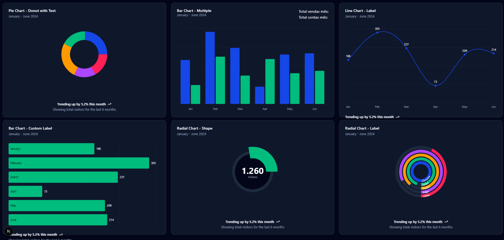
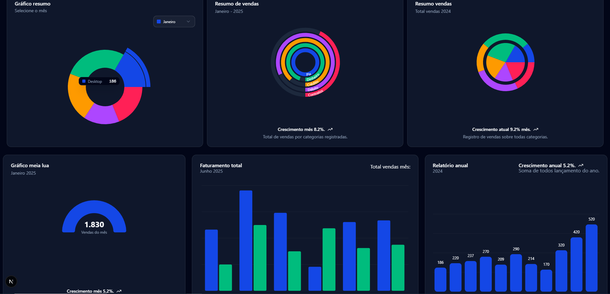
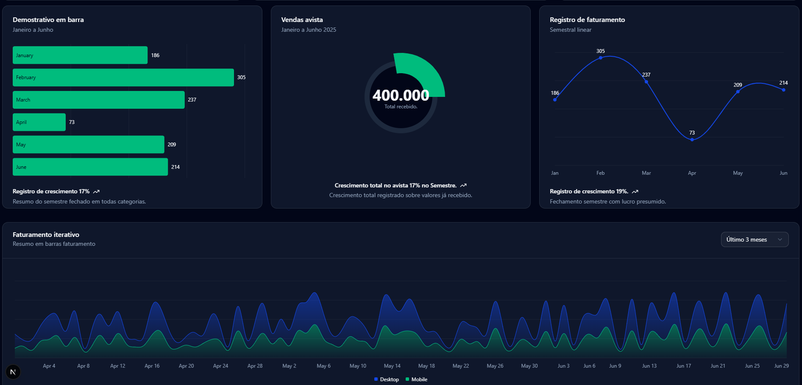

#### Exemplos com NextJS 15 + ShadCN-UI

* Nextjs
* Supbase






#### eslint.config.mjs
```
import { dirname } from "path";
import { fileURLToPath } from "url";
import { FlatCompat } from "@eslint/eslintrc";

const __filename = fileURLToPath(import.meta.url);
const __dirname = dirname(__filename);

const compat = new FlatCompat({
  baseDirectory: __dirname,
});

const eslintConfig = [
  ...compat.extends("next/core-web-vitals", "next/typescript"),
  // Adicione este objeto para configurar regras específicas
  {
    rules: {
      "@typescript-eslint/no-explicit-any": "off", // <-- Adicione esta linha
    },
  },
];

export default eslintConfig;
```

#### Mascara
```
npm install react-input-mask
npm install react-input-mask-next


```


#### Configurar supabase
1. Instalar o Supabase
Execute o seguinte comando para instalar o cliente do Supabase no seu projeto Next.js:

bash
Copiar
Editar
npm install @supabase/supabase-js
2. Configurar o Supabase
Crie um arquivo de configuração para o Supabase. Esse arquivo vai ajudar a inicializar a conexão com o Supabase e será usado em todo o seu app.

Crie o arquivo supabase.ts ou supabase.js dentro da pasta lib ou utils (você pode escolher o nome da pasta).

Aqui está como fazer a configuração:

typescript
Copiar
Editar
// lib/supabase.ts

import { createClient } from "@supabase/supabase-js"

// Substitua pela URL e chave da sua instância Supabase
const supabaseUrl = process.env.NEXT_PUBLIC_SUPABASE_URL || "<YOUR_SUPABASE_URL>"
const supabaseKey = process.env.NEXT_PUBLIC_SUPABASE_KEY || "<YOUR_SUPABASE_ANON_KEY>"

export const supabase = createClient(supabaseUrl, supabaseKey)
3. Variáveis de Ambiente
Agora, você precisa definir a URL e a chave da sua instância Supabase como variáveis de ambiente. Essas variáveis vão em um arquivo .env.local na raiz do seu projeto.

Crie o arquivo .env.local se ainda não o tiver e adicione as variáveis:

env
Copiar
Editar
NEXT_PUBLIC_SUPABASE_URL=https://your-project.supabase.co
NEXT_PUBLIC_SUPABASE_KEY=your-anon-key
Substitua os valores your-project e your-anon-key pelos dados da sua instância Supabase. Esses dados podem ser encontrados no painel de configurações do Supabase.

4. Acessando a Sessão do Supabase
Se você precisa de autenticação de usuário (como estamos usando user_id), você pode pegar a sessão do Supabase diretamente assim que o usuário logar. O Supabase tem métodos para gerenciar a autenticação, como signUp, signIn, e getSession.

O método que estamos utilizando na aplicação para pegar a sessão do usuário é o supabase.auth.getSession(), que já vem configurado para recuperar a sessão do usuário caso ele esteja autenticado.

Agora, com o cliente Supabase instalado e configurado, você deve ser capaz de usar a integração que fizemos no código anterior, que já vai buscar os dados filtrados por user_id do Supabase.

Se tiver mais alguma dúvida ou precisar de mais detalhes sobre a configuração, é só avisar!