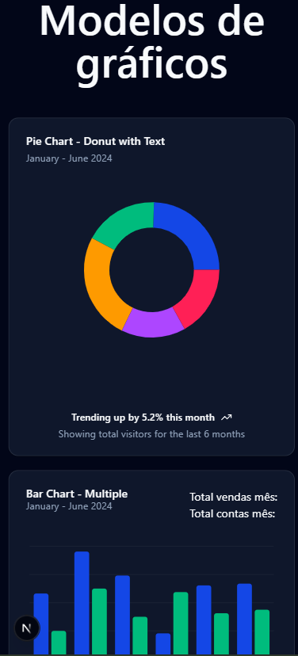

#### Exemplos com NextJS 15 + ShadCN-UI

* Nextjs
* Supbase




#### eslint.config.mjs
```
import { dirname } from "path";
import { fileURLToPath } from "url";
import { FlatCompat } from "@eslint/eslintrc";

const __filename = fileURLToPath(import.meta.url);
const __dirname = dirname(__filename);

const compat = new FlatCompat({
  baseDirectory: __dirname,
});

const eslintConfig = [
  ...compat.extends("next/core-web-vitals", "next/typescript"),
  // Adicione este objeto para configurar regras específicas
  {
    rules: {
      "@typescript-eslint/no-explicit-any": "off", // <-- Adicione esta linha
    },
  },
];

export default eslintConfig;
```

#### Mascara
```
npm install react-input-mask
npm install react-input-mask-next
```

